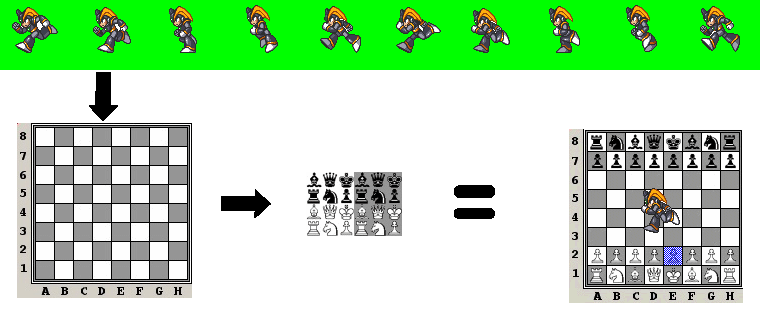



## Complete GDI 2D Sprite class\. \(2D Game Devlopment?\)

### Description

First, keep in mind that this uses Windows API and GDI only. No DirectX. It's certainly not the BEST method in the world for making a 2D game on a windows platform (DirectX would be your best bet) but this is an excellent tool for all 2D GDI work, whether that be manipulating images on the fly, or anything else requiring 2D GDI.

This has a massive amount of commenting in it, and was designed more as a tutorial, and started as a learning experience for myself. However, it is fairly well optimized, and I can do a full screen refresh (with animations) at 1024x768 with a framerate at about 530 FPS (RADEON 9600, AMD 1.5 gHZ) I would be interested in hearing about other people's framerates and system specs.

*** EDIT: After seeing some of the framerates with the "lower end" systems, I'm considering putting together a simple tile-based Legend Of Zelda type of example. If someone wants to beat me to it, feel free. ;) Also, if there's anything you'd like to see added, let me know. I'm not promising I'll add it (since this was really designed for my own personal use) but maybe I can give you an idea how to add it yourself, or if it's something useful to me too, I may end up adding it afterall. (Anyone got a good floodfill algorithm? Been considering adding gradient fills.)
 
### More Info
 

             |
---                |---
**Submitted On**   |2004-07-20 17:43:00
**By**             |[Javin](https://github.com/Planet-Source-Code/PSCIndex/blob/master/ByAuthor/javin.md)
**Level**          |Intermediate
**User Rating**    |5.0 (55 globes from 11 users)
**Compatibility**  |VB 5\.0, VB 6\.0
**Category**       |[Graphics](https://github.com/Planet-Source-Code/PSCIndex/blob/master/ByCategory/graphics__1-46.md)
**World**          |[Visual Basic](https://github.com/Planet-Source-Code/PSCIndex/blob/master/ByWorld/visual-basic.md)
**Archive File**   |[Complete\_G1772087202004\.zip](https://github.com/Planet-Source-Code/javin-complete-gdi-2d-sprite-class-2d-game-devlopment__1-51655/archive/master.zip)

